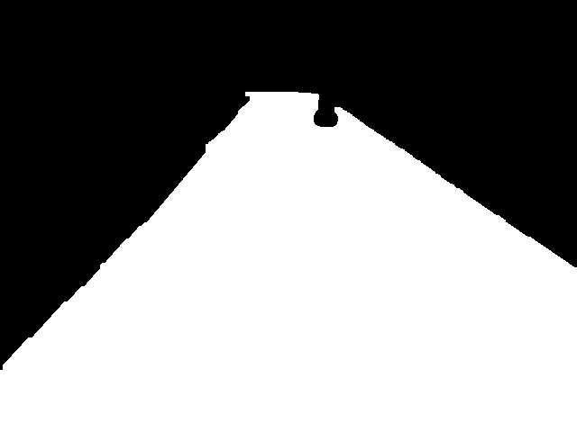
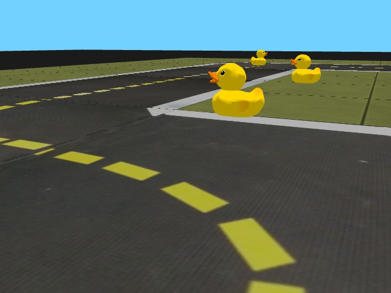

# Right Lane segmentation in Duckietown environment
Repository for private project Duckietown at BME VIK (Budapesti Műszaki és Gazdaságtudományi Egyetem Villamosmérnöki és Informatikai Kar).

All used packages are listed in requirements.txt.
Note however, that this module may work with other setup as well.

All the code related to neural networks are implemented in PyTorch and, recently, in PyTorch Lightning.
Versions are always updated, so I plan to use the newest version possible.
If this repo is finalised, or I wish to make a tag of it then I will add specific version informations.

## Data generation
Data can be manually generated from the modified simulator contained in .
To use it one needs to launch  with a selected map from .

Key bindings:
- Press 'A' to change annotated lane (right/left/none)
- Press 'Enter' to start recording (note: annotated lane should be selected first)
- Press 'Enter' again to stop the recording
- Press 'Backspace' in order to random reset the environment
- Press 'Q' to quit

Additional to selecting a map one may specifiy to use domain randomization with the _domain_rand_ flag set to True.
Another flag worthy of note is _distortion_ that allows camera distortion in domain randomization.

Saving of recorded videos is done via a background thread.
In case of annotation mode change or any reset condition met recording stops automatically.
Recorded video files are located in the created _recordings_ folder.

### Data postprocessing
As the saved videos are _NOT_ ready for training a simple preprocessing script,  helps converting the annotated RGB video to a binary, label-like video.
The post-processed data (now ready for training) is generated by default at _data_ directory.

The post-processing is basically a difference-of-images calculation, followed by binarization and morphological closing and opening.

See postprocess_v2.py for arguments and details.

### Example training data
Data pair 1:




Data pair 2:




## Training
TODO

### Database preprocessing, formatting
Simulation database directory structure before preprocessing is expected to be as follows:
```
simData
├── input
└── label
```
After preprocessing:
```
simData
├── test
│   ├── input
│   └── label
├── train
│   ├── input
│   └── label
└── valid
    ├── input
    └── label
```

Real image database directory structure before preprocessing is expected to be as follows:
```
realData
├── input
├── label
└── unlabelled
```
After preprocessing:
```
realData
├── test
│   ├── input
│   └── label
├── train
│   ├── input
│   └── label
└── unlabelled
    └── input
```

When SSDA training is used, the following directory structure is expected (after preprocessing):
```
dataSSDA
├── source
│   ├── input
│   └── label
└── target
    ├── test
    │   ├── input
    │   └── label
    ├── train
    │   ├── input
    │   └── label
    └── unlabelled
        └── input
```

### Base architectures
I have tried a couple of segmentation networks that were:
- A custom network consisting of an encoder path and a decoder path, named EncDecNet among the models.
- FC-DenseNet, that offers less parameters with same accuracy. [Paper](https://arxiv.org/abs/1611.09326), code copied from [here](https://github.com/bfortuner/pytorch_tiramisu).

After some initial trials currently FC-DenseNet57 is in use.
It proved to be easy to train and also offered encouraging accuracy on real images without any domain adaptation technique applied.

### Domain adaptation
However good or encouraging was the result on the real image test it was still not good enough to apply it as a part of another system, to build on it.
So after some advice I tried Semi-Supervised Domain Adaptation with Minimax Entropy (short terms are SSDA MME) according to [this](https://arxiv.org/pdf/1904.06487.pdf) paper.
Fortunately the authors also publicised their own code written in PyTorch, found [here](https://github.com/VisionLearningGroup/SSDA_MME) and it is the current focus to apply the methods they have implemented.

With domain adaptation my hope is that the domain gap can easily be stepped over in this segmentation task.

## Usage
The training process consisted of three (plus one) separate model training:
- Simulator baseline training
- Same training on domain-converted sim data (via CycleGAN - plus one training)
- SSDA MME training

### Simulator baseline
Simulator baseline training can be reproduced using the following command:
```
CUDA_VISIBLE_DEVICES=0 python3.6 RightLaneModule.py --gpus=1 --dataPath ./simData --batchSize 64 --max_epochs 150
```

Naturally CUDA and GPU dependent parameters can be changed to better utilize the hardware.

### Domain Transformation using CycleGAN
After CycleGAN training for sim-to-real conversion the training process is the same.
Simulator baseline training can be reproduced using the following command:
```
CUDA_VISIBLE_DEVICES=0 python3.6 RightLaneModule.py --gpus=1 --dataPath ./simData --batchSize 64 --max_epochs 150
```

### SSDA via Minimax Entropy
The training script uses the baseline weights to shorten the training process.
Otherwise it has the same parameters as the baseline training.
Simulator baseline training can be reproduced using the following command:
```
CUDA_VISIBLE_DEVICES=0 python3.6 RightLaneMMEModule.py --gpus=1 --dataPath ./realData --pretrained_path results/FCDenseNet57weights.pth --batchSize 64 --max_epochs 150
```

### Testing
Trained model evaluation can be done using the provided script test.py.
The script takes command line arguments, see help for details.

Comparison of trained models can be done using comparison.py that generates an image file with sample predictions of each model.

One is able to make predictions for a video (stream of images) via makeDemoVideo.py.
